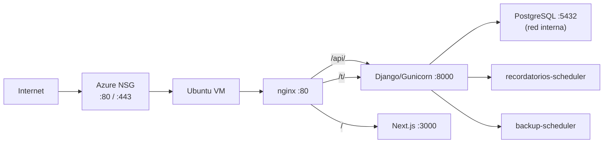

# Despliegue en Azure VM — Oftalmología Si2

Guía DevOps para publicar el stack **Django + PostgreSQL + Next.js + nginx** en una **VM Linux de Azure**, usando el DNS público:

**`oftalmologia-si2.westus3.cloudapp.azure.com`**

---

## Arquitectura en la VM



| Servicio | Expuesto al internet | Rol |
|----------|---------------------|-----|
| **nginx** | Sí (80, luego 443) | Reverse proxy único |
| frontend | No | UI Next.js |
| backend | No | API Django multi-tenant |
| db | No | PostgreSQL |
| mailhog | No (solo dev) | Desactivado en prod |

**Importante multi-tenant:** las rutas de clínica van a `/t/<slug>/api/...`. nginx **debe** proxy `/t/` al backend (ya configurado en `nginx/default.prod.conf`).

---

## Parte A — Crear recursos en Azure Portal

### 1. Resource Group

1. Portal Azure → **Resource groups** → **Create**
2. Nombre: `rg-oftalmologia-si2`
3. Región: **West US 3** (coincide con `westus3` en tu DNS)

### 2. Virtual Machine

1. **Create a resource** → **Virtual machine**
2. Configuración recomendada inicial:
   - **Image:** Ubuntu Server 22.04 LTS
   - **Size:** Standard B2s (2 vCPU, 4 GiB) o superior
   - **Authentication:** SSH public key (recomendado)
   - **Public inbound ports:** SSH (22), HTTP (80), HTTPS (443)
3. **Networking:** anotá el **Public IP** y el **DNS name** (cloudapp)

### 3. DNS público (cloudapp)

Si aún no lo tenés:

1. VM → **Public IP** → **Configuration**
2. **DNS name label:** `oftalmologia-si2`
3. FQDN resultante: `oftalmologia-si2.westus3.cloudapp.azure.com`

### 4. Network Security Group (NSG)

En **Networking** → **Inbound port rules**, permitir **solo**:

| Prioridad | Puerto | Origen | Uso |
|-----------|--------|--------|-----|
| 100 | 22 | Tu IP / Any* | SSH |
| 110 | 80 | Any | HTTP (nginx) |
| 120 | 443 | Any | HTTPS (fase 2) |

**No abras** 3000, 8000, 5432, 8025 hacia internet.

\* En producción real, restringí SSH a tu IP.

---

## Parte B — Preparar la VM (Ubuntu)

Conectate por SSH:

```bash
ssh azureuser@oftalmologia-si2.westus3.cloudapp.azure.com
```

### 1. Actualizar sistema

```bash
sudo apt update && sudo apt upgrade -y
```

### 2. Docker + Compose v2

```bash
sudo apt install -y docker.io docker-compose-v2 git curl
sudo systemctl enable --now docker
sudo usermod -aG docker $USER
```

Cerrá sesión SSH y volvé a entrar para usar `docker` sin `sudo`.

### 3. Clonar el repo

```bash
cd ~
git clone https://github.com/TU_ORG/Oftalmologia-Si2.git
cd Oftalmologia-Si2
git checkout feature/web-progresiva   # o la rama que despliegues
```

---

## Parte C — Variables de entorno

### Opción automática (recomendada)

```bash
chmod +x scripts/azure/*.sh
./scripts/azure/generate-env.sh oftalmologia-si2.westus3.cloudapp.azure.com > .env
nano .env   # completar EMAIL, GEMINI_API_KEY si aplica
```

### Valores críticos

| Variable | Valor ejemplo | Por qué |
|----------|---------------|---------|
| `DJANGO_ALLOWED_HOSTS` | `...,oftalmologia-si2.westus3.cloudapp.azure.com` | Django rechaza otros hosts |
| `NEXT_PUBLIC_API_URL` | `http://TU-DOMINIO/api` | Se embebe en el build de Next.js |
| `FRONTEND_URL` | `http://TU-DOMINIO` | Links en emails, checkout |
| `PUBLIC_DOMAIN` | mismo FQDN | Bootstrap tenant en entrypoint |
| `CORS_ALLOWED_ORIGINS` | `http://...,https://...` | Obligatorio si `DJANGO_DEBUG=False` |
| `DJANGO_SECURE_SSL_REDIRECT` | `False` (HTTP) → `True` (HTTPS) | Evita redirect loop sin certificado |

Plantilla de referencia: `.env.azure.example`

---

## Parte D — Desplegar contenedores

### Script todo-en-uno

```bash
./scripts/azure/deploy.sh oftalmologia-si2.westus3.cloudapp.azure.com
```

### Manual (equivalente)

```bash
./scripts/azure/patch-nginx-domain.sh oftalmologia-si2.westus3.cloudapp.azure.com
docker compose -f docker-compose.yml -f docker-compose.prod.yml up -d --build
```

El overlay `docker-compose.prod.yml`:

- Backend con **Gunicorn** (no `runserver`)
- Frontend con **`npm run build && npm start`**
- Solo **nginx** publica puerto 80
- Mailhog desactivado (profile `dev-mail`)
- nginx usa `nginx/default.prod.conf`

### Verificar

```bash
docker compose -f docker-compose.yml -f docker-compose.prod.yml ps
docker compose logs -f backend
curl -I http://127.0.0.1/api/health/
curl -I http://127.0.0.1/
```

Desde tu PC: **http://oftalmologia-si2.westus3.cloudapp.azure.com**

Login demo (si seeders corrieron): ver `docs/ai/DEMO_CREDENTIALS.md`

---

## Parte E — HTTPS (Let's Encrypt + certbot)

Con `DJANGO_DEBUG=False`, Django fuerza HTTPS cuando `DJANGO_SECURE_SSL_REDIRECT=True`. Orden recomendado:

### Fase 1 — HTTP funcionando

- `DJANGO_SECURE_SSL_REDIRECT=False`
- URLs en `.env` con `http://`

### Fase 2 — Certificado en la VM

```bash
sudo apt install -y certbot
sudo certbot certonly --standalone -d oftalmologia-si2.westus3.cloudapp.azure.com
# Detener nginx momentáneamente si el puerto 80 está ocupado:
# docker compose -f docker-compose.yml -f docker-compose.prod.yml stop nginx
```

Montar certs en nginx (añadir bloque `listen 443 ssl` en `nginx/default.prod.conf` o usar contenedor certbot companion). Tras HTTPS:

1. Editar `.env`:
   - `NEXT_PUBLIC_API_URL=https://oftalmologia-si2.westus3.cloudapp.azure.com/api`
   - `FRONTEND_URL=https://...`
   - `CORS_ALLOWED_ORIGINS=https://...`
   - `DJANGO_SECURE_SSL_REDIRECT=True`
2. Rebuild frontend (NEXT_PUBLIC se bakea en build):
   ```bash
   docker compose -f docker-compose.yml -f docker-compose.prod.yml up -d --build frontend
   ```
3. nginx debe enviar `X-Forwarded-Proto https` (ya configurado con `$scheme` tras TLS termination).

**PWA:** instalación completa requiere HTTPS.

---

## Parte F — Actualizar en producción

```bash
cd ~/Oftalmologia-Si2
git pull
docker compose -f docker-compose.yml -f docker-compose.prod.yml up -d --build
docker compose -f docker-compose.yml -f docker-compose.prod.yml logs -f backend
```

Migraciones: el `entrypoint.sh` del backend ejecuta `migrate_schemas` al arrancar si `RUN_MIGRATIONS=1` (default).

Para updates sin re-seed:

```bash
# en .env
RUN_SEEDERS=0
```

---

## nginx — qué hace cada `location`

| Ruta | Destino | Ejemplo |
|------|---------|---------|
| `/api/` | backend | `/api/health/`, `/api/public/...` |
| `/t/` | backend | `/t/clinica-demo/api/auth/login/` |
| `/admin/` | backend | Django admin |
| `/static/`, `/media/` | backend | Archivos |
| `/` | frontend | Dashboard Next.js |

Archivos:

- Desarrollo/local con nginx: `nginx/default.conf`
- Producción Azure: `nginx/default.prod.conf`

---

## Mobile (Flutter)

En tu máquina de desarrollo, `mobile/.env`:

```env
API_BASE_URL=https://oftalmologia-si2.westus3.cloudapp.azure.com/api
```

El app construye rutas tenant como `{origin}/t/{slug}/api`.

---

## Troubleshooting

| Síntoma | Causa probable | Acción |
|---------|----------------|--------|
| `502 Bad Gateway` nginx | backend/frontend caídos | `docker compose logs backend frontend` |
| Login tenant falla, público OK | Falta `location /t/` | Verificar `nginx/default.prod.conf` |
| Redirect infinito a HTTPS | SSL redirect sin cert | `DJANGO_SECURE_SSL_REDIRECT=False` temporalmente |
| Frontend sin estilos/API | `NEXT_PUBLIC_API_URL` mal o build viejo | Rebuild frontend tras cambiar `.env` |
| `host not found in upstream "backend"` | Red Docker rota | `docker compose down && docker compose up -d` |
| Build frontend falla (ESLint) | Errores preexistentes | Corregir lint o build local primero |

---

## Checklist pre-demo / pre-producción

- [ ] NSG: solo 22, 80, 443
- [ ] `.env` con secretos fuertes (no commitear)
- [ ] `DJANGO_DEBUG=False`
- [ ] HTTPS activo + `DJANGO_SECURE_SSL_REDIRECT=True`
- [ ] SMTP real (no Mailhog)
- [ ] `RUN_SEEDERS=0` si no querés datos demo
- [ ] Backup de volumen `postgres_data`
- [ ] Credenciales demo rotadas o deshabilitadas

---

## Referencia rápida

| Acción | Comando |
|--------|---------|
| Generar `.env` | `./scripts/azure/generate-env.sh TU-DOMINIO > .env` |
| Deploy | `./scripts/azure/deploy.sh TU-DOMINIO` |
| Logs | `docker compose -f docker-compose.yml -f docker-compose.prod.yml logs -f` |
| Parar | `docker compose -f docker-compose.yml -f docker-compose.prod.yml down` |

Ver también: `docs/guides/despliegue-ubuntu-nube.md` (base Ubuntu + Docker).
